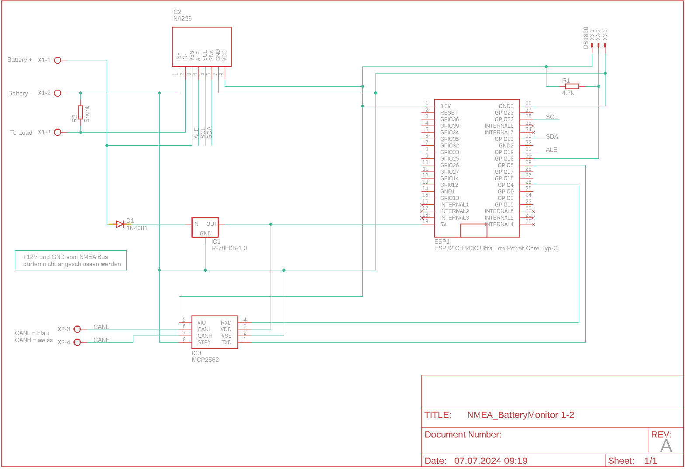
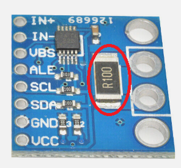

# NMEA Battery monitor


## Table of contents
- [NMEA Battery monitor](#nmea-battery-monitor)
	- [Table of contents](#table-of-contents)
	- [Description](#description)
	- [Disclaimer](#disclaimer)
	- [Schema](#schema)
	- [NMEA 2000](#nmea-2000)
	- [Librarys](#librarys)
	- [Part list](#part-list)
		- [Shunt housing](#shunt-housing)
	- [Running values](#running-values)
		- [Battery voltage](#battery-voltage)
		- [Current](#current)
		- [Avg current](#avg-current)
		- [State of charge (Soc)](#state-of-charge-soc)
		- [Time to go (Ttg)](#time-to-go-ttg)
		- [Battery full](#battery-full)
		- [Temperature](#temperature)
	- [Statistics](#statistics)
	- [Configuration](#configuration)
		- [System configuration](#system-configuration)
			- [Thing name](#thing-name)
			- [AP password](#ap-password)
			- [WiFi SSID](#wifi-ssid)
			- [WiFi password](#wifi-password)
			- [start AP only at boot sequence](#start-ap-only-at-boot-sequence)
			- [AP offline mode after (minutes)](#ap-offline-mode-after-minutes)
		- [NEMA configuration](#nema-configuration)
			- [Instance](#instance)
			- [SID](#sid)
		- [Shunt settings](#shunt-settings)
			- [Shunt resistance \[Ω\] __\*__](#shunt-resistance-ω-)
			- [Expected max current \[A\] __\*__](#expected-max-current-a-)
			- [Voltage calibration factor](#voltage-calibration-factor)
			- [Current calibration factor](#current-calibration-factor)
		- [Battery](#battery)
			- [Type __\*__](#type-)
			- [Voltage __\*__](#voltage-)
			- [Chemistrie __\*__](#chemistrie-)
			- [Capacity __\*__](#capacity-)
			- [charge efficiency \[%\]](#charge-efficiency-)
			- [Minimun SOC \[%\]](#minimun-soc-)
			- [Replacment date](#replacment-date)
			- [Manufacturer](#manufacturer)
		- [Battery full detection](#battery-full-detection)
			- [Voltage when full \[V\] __\*__](#voltage-when-full-v-)
			- [Tail current \[A\] __\*__](#tail-current-a-)
			- [Delay before full \[s\] __\*__](#delay-before-full-s-)
			- [Current threshold](#current-threshold)
			- [Statistics Page](#statistics-page)
	- [Username and password](#username-and-password)
	- [Default IP address](#default-ip-address)
	- [Firmware Update](#firmware-update)
	- [Blinking codes](#blinking-codes)
	- [Reset](#reset)

## Description
The INA226 is a versatile current and power monitor chip that can be used to create a battery monitor. It measures both voltage and current, taking into account the direction of current flow (whether it’s from or to the battery). Based on the configured ampere-hours (Ah), current, and voltage, it calculates the battery's state of charge.

Here are some key details about the INA226:
- Voltage Measurement Range: 0V to 36V DC
- Shunt Voltage Range (for current measurement): ±82mV
- The INA226 can handle shunt voltages as low as 60mV and as high as 82mV, depending on the current and the shunt resistor used

The INA226 should be connected to the shunt so that charges going into the battery are positive and those coming out of the battery are negtive.

 The system communicates via the NMEA 2000 protocol, sending temperature values and alarms as NMEA 2000 messages over an NMEA bus. Configuration is done through a web interface, and real-time values can be viewed on a website. Additionally, there's a link on the configuration page for convenient firmware updates.

 ## Disclaimer
 | | |
 |-|-----------------|
 |  | Allways use a fuse in the + line from the battery to the sensor!! |
 |  | Be careful when using metal tools in the vicinity of batteries. Dropping a metal tool onto a battery might cause a short circuit and possibly an explosion.

## Schema



## NMEA 2000
The following PGN's will be send
- 127506
- 127508
- 127513

## Librarys 

The Software has been created using Visual Studio with the addon Visual Micro. In order to build it you als need some libraries.

- Wire
- [OneWire (2.3.7)](https://github.com/PaulStoffregen/OneWire)
- [DallasTemperature(3.9.0)](https://github.com/milesburton/Arduino-Temperature-Control-Library)
- [NMEA2000](https://github.com/ttlappalainen/NMEA2000)
- [NMEA200_ESP32](https://github.com/ttlappalainen/NMEA2000_esp32)
- [AsyncTCP (3.2.6) __"__](https://github.com/mathieucarbou/AsyncTCP)
- [ESPAsyncWebServer (3.3.12) __*__](https://github.com/mathieucarbou/ESPAsyncWebServer)
- [Webserial (2.0.7) __*__](https://github.com/ayushsharma82/WebSerial)
- [IotWebConf](https://github.com/minou65/IotWebConf)
- [IotWebConfAsync (1.0.2) __*__](https://github.com/minou65/IotWebConfAsync)
- [IotWebRoot](https://github.com/minou65/IotWebRoot)

__*__ new version and/or new repo

## Part list
| Part | Value | Supplier |
| --- | --- | --- |
| D1 | 1N4001 | Reichelt |
| ESP1 | ESP32DEVKITV1 | [ebay](https://www.ebay.ch/itm/204191675506?var=504772734176) |
| IC1 | R-78E05-1.0 | Reichelt |
| IC2 | INA226 | [ebay](https://www.ebay.ch/itm/314750066199) |
| IC3 | MCP2562 | Reichelt oder [ebay](https://www.ebay.ch/itm/364610349378) |
| R1 | 4.7k | Reichelt |
| R2 | Shunt | [ebay](https://www.ebay.ch/itm/164378822180?var=463997139291) |
| X1 | AKL 057-03 | Reichelt |
| X2 | AKL 057-02 | Reichelt |
| X3 | PSS 254/3G | Reichelt |

__Before you can use the sensor board you have to remove the shunt resistor soldered to that board and instead use a bigger shunt, e.g. a 100A/75mV.__



You also need a __shunt__, since the small resistor on the board (__dont forget to remove it!__) will not survive the high currents.
There are plenty of options out there. Make sure that you select a resistor appropriate for the currents you expect. I'm using a 100A/75mV shunt.

If you have a 48V System, be aware of the fact that the INA226 does only support voltages up to 36V (40V max). You need a voltage divider to make shure your sensor is not destroyed. 
The code assumes that you use a __470KOhm and a 1MOhm__ resistor, measuring across the 1MOhm towards GND. `( + --470K-- --1M -- GND )` The smaller you choose the small resistor in comparison to the bigger one, the more accurate the measurement will be.

### Shunt housing
In the stl folder you will find a housing for the shunt.


## Running values
### Battery voltage

### Current
Current in amperes flowing through the shunt. If the current is positiv, the battery is being charged. If it is negative, the battery is being discharged.
See [Current calibration factor](#current-calibration-factor) for more information.

### Avg current
The average current consumption in the last 60 seconds.

### State of charge (Soc)
Shows the charge level of the battery. This is calculated based on the capacity and the Ah consumed and is an estimate based on the current consumption.

If no shunt is used and the current calibration factor is set to 0, the following table is used to calculate the Soc


### Time to go (Ttg)
If the time is 00:00, then the battery is charging. Otherwise, it will display an estimate in hours and minutes of how long, based on the current consumption, it will take until the battery is empty.

### Battery full
true or false

### Temperature

## Statistics


## Configuration
After the first boot, there are some values needs to be set up.
These items are maked with __*__ (star) in the list below.

### System configuration

#### Thing name
Please change the name of the device to a name you think describes it the most. It is advised to incorporate a location here in case you are planning to set up multiple devices in the same area. You should only use english letters, and the "_" underscore character. Thus, must not use Space, dots, etc. E.g. `main_cabin` __*__

#### AP password
This password is used, when you want to access the device later on. You must provide a password with at least 8, at most 32 characters. You are free to use any characters, further more you are encouraged to pick a password at least 12 characters long containing at least 3 character classes. __*__

#### WiFi SSID
The name of the WiFi network you want the device to connect to. __*__

#### WiFi password
The password of the network above. Note, that unsecured passwords are not supported in your protection. __*__

#### start AP only at boot sequence
This checkbox, when selected, ensures that the Access Point (AP) is initiated only after the system's boot sequence for the time set in the Startup delay. This can be useful for optimizing system performance and security by preventing the AP from starting at other times, which could potentially lead to unauthorized access or unnecessary resource consumption.

The difference to the setting AP offline mode is that after a successful connection to a WiFi, if the connection is lost, it will not fall back to AP mode.

#### AP offline mode after (minutes)
If you don’t plan to connect the sensor to a WiFi network, you don’t need to configure the two options above. If you want to disable the WiFi after a certain time, you can use this option. Specify how long the WiFi should remain enabled after turning on the sensor. Valid values are from 0 to 30 minutes. A value of 0 means that WiFi is always enabled.

### NEMA configuration
#### Instance
This should be unique at least on one device. May be best to have it unique over all devices sending this PGN. A total of 5 instances are occupied by the device. Starting with the number set here. __*__

#### SID
Sequence identifier. In most cases you can use just 255 for SID. The sequence identifier field is used to tie different PGNs data together to same sampling or calculation time.

### Shunt settings
#### Shunt resistance [Ω] __*__
```
R = U / I

U in V
I in A
R in Ohm
```

Assuming a voltage of 75 mV at nominal current, the resulting resistance in ohms will be as follows:

| Shunt Current | Resistance in Ohm | Remarks |
| --- | --- | --- |
| 2 | 100 | Original resistor on the board. |
| 50A | 1.500 |
| 100A | 0.750 |
| 200A | 0.375 |
| 300A | 0.250 |


#### Expected max current [A] __*__
maximum current that may flow through the shut

#### Voltage calibration factor
Use a multimeter to measure the voltage on the battery. The measured voltage divided by the voltage displayed by the battery monitor gives the factor that you enter here.

#### Current calibration factor
Use a multimeter to measure the current at the shunt. The measured current, divided by the current displayed by the battery monitor, gives the factor that you need to enter here.

Normally a positive current means that the battery is being charged, a negative current means that it is being discharged. If this is the other way round due to incorrect installation of the shunt, the current can be "reversed" by a negative factor.

If this value is set to 0, no current will be measured. This can be useful if no shunt is installed, such as in a starter battery where only voltage and temperature need to be monitored. See also [State of charge (Soc)](#state-of-charge-soc).

### Battery
#### Type __*__
one of the following
- flooded
- gel
- AGM

#### Voltage __*__
- 6V
- 12V
- 24V
- 32V
- 62V
- 42V
- 48V

Please note that the sensor is built for a maximum voltage of 40V without any special measures!

#### Chemistrie __*__
- lead acid
- LiIon
- NiCad
- NiMh

#### Capacity __*__
This parameter is used to tell the battery monitor how big the battery is.

The setting is the battery capacity in Amp-hours (Ah).

#### charge efficiency [%] 
The "Charge Efficiency Factor" compensates for the capacity (Ah) losses during charging. A setting of 100% means that there are no losses.
A charge efficiency of 95% means that 10Ah must be transferred to the battery to get 9.5Ah actually stored in the battery. The charge efficiency of a 
battery depends on battery type, age and usage. The battery monitor takes this phenomenon into account with the charge efficiency factor.

The charge efficiency of a lead acid battery is almost 100% as long as no gas generation takes place. Gassing means that part of the charge current 
is not transformed into chemical energy, which is stored in the plates of the battery, but is used to decompose water into oxygen and hydrogen 
gas (highly explosive!). The energy stored in the plates can be retrieved during the next discharge, whereas the energy used to decompose water is lost. 
Gassing can easily be observed in flooded batteries. Please note that the ‘oxygen only’ end of the charge phase of sealed (VRLA) gel 
and AGM batteries also results in a reduced charge efficiency.

#### Minimun SOC [%]
The minimum SoC is the lowest level of charge that a battery can safely operate at without damaging its cells or reducing its capacity. It is usually expressed as a percentage of the maximum charge. For example, if a battery has a minimum SoC of 10%, it means that it should not be discharged below 10% of its full capacity.

#### Replacment date
The replacement date is the date when the battery was replaced with a new one. It is only for documentation

#### Manufacturer
Manufacturer can be used for documentation

### Battery full detection
#### Voltage when full [V] __*__
The battery voltage must be above this voltage level to consider the battery as fully charged. As soon as the battery monitor detects that the 
voltage of the battery has reached this "charged voltage" parameter and the current has dropped below the "tail current" parameter for a certain 
amount of time, the battery monitor will set the state of charge to 100%.

The following table can help set the correct value

| Type | fully charged |
| --- | --- |
| 12V lead acid | 12.85V |
| 12V AGM | 12.85V |
| 12V LiIon | 12.65V |

#### Tail current [A] __*__
The battery is considered as fully charged once the charge current has dropped to less than this "Tail current" parameter. 
The "Tail current" parameter is expressed as a percentage of the battery capacity.

Note that some battery chargers stop charging when the current drops below a set threshold. In these cases, the tail current must be set 
higher than this threshold.

As soon as the battery monitor detects that the voltage of the battery has reached the set "Charged voltage" parameter and the current has 
dropped below this "Tail current" parameter for a certain amount of time, the battery monitor will set the state of charge to 100%.

#### Delay before full [s] __*__
This is the time the "Voltage when full [V]" parameter and the "Tail current [A]" parameter must be met in order to consider the battery fully charged.

#### Current threshold
When the current measured falls below the "Current threshold" parameter it will be considered zero. The "Current threshold" is used to cancel out very small currents that can negatively affect the long-term state of charge readout in noisy environments. For example, if the actual long-term current is 0.0A and, due to injected noise or small offsets, the battery monitor measures ­0.05A the battery monitor might, in the long term, incorrectly indicate that the battery is empty or will need to be recharged. When the current threshold in this example is set to 0.1A, the battery monitor calculates with 0.0A so that errors are eliminated.

#### Statistics Page

The Statistics page provides detailed information about the performance and status of your device. Here are the key metrics displayed on this page:

- **Min Volt**: Displays the minimum voltage recorded, e.g., 10.5V.
- **Max Volt**: Displays the maximum voltage recorded, e.g., 13.4V.
- **Charged Energy**: Indicates the total energy charged, measured in kWh.
- **Discharged Energy**: Indicates the total energy discharged, measured in kWh.
- **Total Ah Drawn**: Shows the total ampere-hours drawn.
- **Last Discharged Energy**: Displays the energy discharged during the last cycle.
- **Deepest Discharged Energy**: Shows the deepest discharge recorded.
- **Min Temperature**: Displays the minimum temperature recorded.
- **Max Temperature**: Displays the maximum temperature recorded.
- **Charge Cycles**: Indicates the number of charge cycles completed.
- **Auto Syncs**: Shows the number of automatic synchronizations. Auto Syncs occur every time the sensor detects that the battery is full. In this case, the State of Charge (SOC) is set to 100%.
- **Time Since Last Full**: Displays the time elapsed since the battery was last fully charged.

Additionally, there is a **Reset Statistics** button available on this page. Pressing this button will reset all the recorded statistics to their default values. This can be useful for starting fresh measurements or troubleshooting purposes.

These statistics help you monitor the health and performance of your device, ensuring it operates efficiently and effectively.

## Username and password
Username is admin. when not connected to an AP the default password is 123456789.

## Default IP address
When in AP mode, the default IP address is 192.168.4.1

## Firmware Update
To update the firmware, navigate to the Configuration page and click on the Firmware Update link. Follow the on-screen instructions to complete the update process.

## Blinking codes
Prevoius chapters were mentioned blinking patterns, now here is a table summarize the menaning of the blink codes.

| Blinking Pattern | Meaning |
| --- | --- |
| Rapid blinking <\br>(mostly on, interrupted by short off periods) | Entered Access Point mode. This means the device creates its own WiFi network. You can connect to the device with your smartphone or WiFi capable computer. |
| Alternating on/off blinking | Trying to connect to the configured WiFi network. |
| Mostly off with occasional short flash | The device is online. |
| Mostly off with occasional long flash | The device is in offline mode |

## Reset
When CONFIG_PIN is pulled to ground on startup, the Thing will use the initial
password to buld an AP. (E.g. in case of lost password)

Reset pin is GPIO 13
